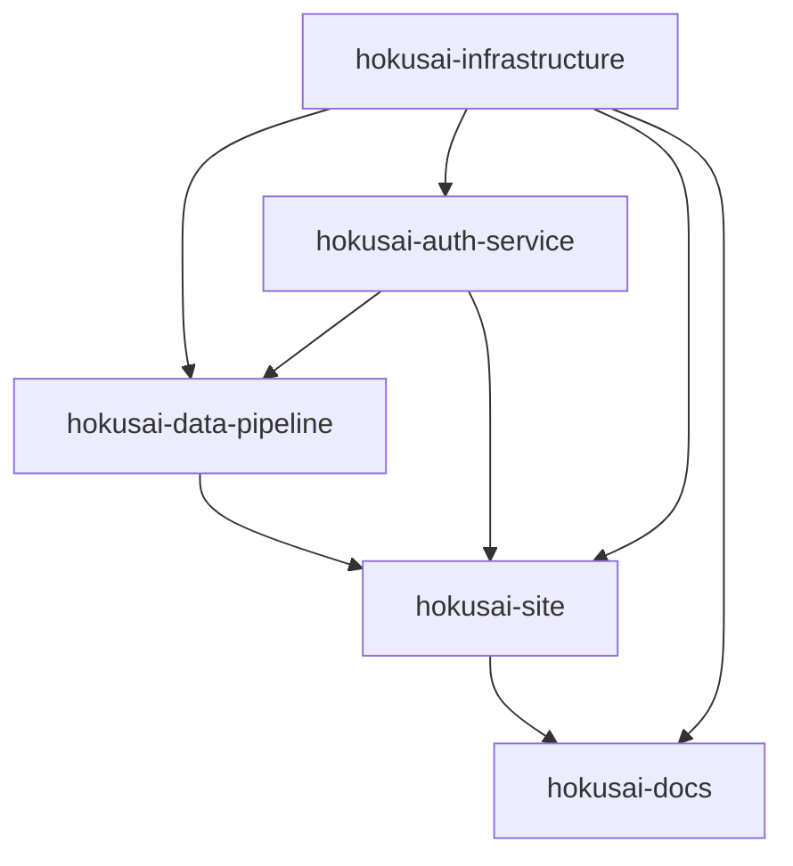

# Hokusai Data Pipeline - Claude Configuration

<!-- START: SHARED ARCHITECTURE SECTION - DO NOT MODIFY -->
# Hokusai Multi-Repository Architecture

## System Overview
Hokusai is a distributed AI model serving platform consisting of five interconnected repositories. When working on ANY feature or fix, you MUST consider cross-repository dependencies and impacts.

## Repository Map

| Repository | Purpose | Location | Primary Domain |
|------------|---------|----------|----------------|
| hokusai-infrastructure | Shared AWS infrastructure (Terraform) | `../hokusai-infrastructure` | N/A - Infrastructure only |
| hokusai-data-pipeline | ML tooling, MLFlow registry, model serving | `../hokusai-data-pipeline` | `api.hokus.ai`, `registry.hokus.ai` |
| hokusai-auth-service | Authentication, authorization, billing | `../hokusai-auth-service` | `auth.hokus.ai` |
| hokusai-site | Public website, model marketplace | `../hokusai-site` | `hokus.ai` |
| hokusai-docs | Documentation (Docusaurus) | `../hokusai-docs` | `docs.hokus.ai` |

## Cross-Repository Dependencies



## Service Communication

### Internal Services (ECS/Service Discovery)
- Auth Service: `http://auth.hokusai-development.local:8000`
- MLFlow Service: `http://mlflow.hokusai-development.local:5000`
- API Service: `http://api.hokusai-development.local:8001`

### External Endpoints (via ALB)
- Auth API: `https://auth.hokus.ai`
- Data Pipeline API: `https://api.hokus.ai`
- Model Registry: `https://registry.hokus.ai`
- Main Site: `https://hokus.ai`
- Documentation: `https://docs.hokus.ai`

## Before Making Changes - CRITICAL CHECKLIST

1. **Check Infrastructure Dependencies**
   ```bash
   # From any repo, check infrastructure configuration
   grep -r "your-change" ../hokusai-infrastructure/environments/
   ```

2. **Verify Service Communication**
   - Will this break any API contracts?
   - Do other services depend on this endpoint?
   - Are there hardcoded URLs that need updating?

3. **Database Impact**
   - Does this require schema changes?
   - Will this affect other services using the same database?

4. **Authentication Flow**
   - Does this change require auth service updates?
   - Will this affect JWT token validation?

## Deployment Order (ALWAYS FOLLOW)
1. Infrastructure changes (Terraform)
2. Database migrations
3. Auth service (if changed)
4. Data pipeline services (if changed)
5. Site updates
6. Documentation updates

## Hokusai Architect Agent

When planning features that span multiple repositories, ALWAYS use the hokusai-architect agent:

```typescript
await Task({
  subagent_type: "hokusai-architect",
  description: "Plan multi-repo feature",
  prompt: `
    Analyze and plan: ${feature_description}
    
    Current repository: hokusai-data-pipeline
    
    Requirements:
    1. Identify ALL affected repositories
    2. Check for breaking changes
    3. Define implementation order
    4. Create tasks for each repository
    5. Document API changes
    6. Plan rollback strategy
  `
});
```

### When to Use hokusai-architect Agent
- Adding new features that touch multiple services
- Changing API contracts
- Modifying authentication/authorization
- Adding new infrastructure components
- Planning major refactoring
- Implementing new ML model serving capabilities
- Adding billing/payment features

## Environment Variables (Consistent Across Services)

```bash
# Standard across all services
ENVIRONMENT=development|staging|production
AWS_REGION=us-east-1

# Service discovery
MLFLOW_SERVER_URL=http://mlflow.hokusai-development.local:5000
AUTH_SERVICE_URL=https://auth.hokus.ai  # External
AUTH_SERVICE_INTERNAL_URL=http://auth.hokusai-development.local:8000  # Internal

# Database connections (from Secrets Manager)
DATABASE_URL=postgresql://[user]@[host]:5432/[database]
```

## Common Pitfalls to Avoid

1. **Never hardcode service URLs** - Use environment variables
2. **Don't skip infrastructure repo** when adding AWS resources
3. **Always update service discovery** when changing internal endpoints
4. **Check ALB routing rules** before adding new paths
5. **Verify CORS settings** for cross-domain requests
6. **Test inter-service auth** after any auth changes
7. **Update docs repo** for any API changes

## Quick Commands for Cross-Repo Work

```bash
# Check all repos for a specific string/configuration
for repo in infrastructure data-pipeline auth-service site docs; do
  echo "=== hokusai-$repo ==="
  grep -r "search-term" ../hokusai-$repo/ --include="*.ts" --include="*.tf" --include="*.yml"
done

# Check service health across all endpoints
for endpoint in auth.hokus.ai api.hokus.ai registry.hokus.ai; do
  echo "=== $endpoint ==="
  curl -s https://$endpoint/health | jq .
done

# View logs for all ECS services
aws logs tail /ecs/hokusai-auth-development --follow &
aws logs tail /ecs/hokusai-api-development --follow &
aws logs tail /ecs/hokusai-mlflow-development --follow &
```
<!-- END: SHARED ARCHITECTURE SECTION -->

# Data Pipeline Service Specific Configuration

## This Repository (hokusai-data-pipeline)

### Primary Responsibilities
- MLFlow server for model registry and tracking
- API service for model serving and inference
- Data processing pipelines
- Model deployment and versioning
- Integration with S3 for model storage

### Key Services

#### 1. MLFlow Service
- **Port**: 5000
- **Internal URL**: `http://mlflow.hokusai-development.local:5000`
- **External URL**: `https://registry.hokus.ai`
- **Database**: PostgreSQL (mlflow_db)
- **ECS Service**: `hokusai-mlflow-development`

#### 2. API Service
- **Port**: 8001
- **Internal URL**: `http://api.hokusai-development.local:8001`
- **External URL**: `https://api.hokus.ai`
- **ECS Service**: `hokusai-api-development`
- **Depends on**: MLFlow service, Auth service

### Infrastructure Dependencies
- **ECS Cluster**: `hokusai-development`
- **ALBs**: 
  - Main ALB: `hokusai-main-development`
  - Registry ALB: `hokusai-registry-development`
  - Data Pipeline ALB: `hokusai-dp-development`
- **Database**: RDS PostgreSQL instance `hokusai-mlflow-development`
- **S3 Buckets**: Model artifacts storage
- **Service Discovery Namespace**: `hokusai-development.local`

### API Endpoints

#### Public API (`api.hokus.ai`)
- `/api/v1/models` - List available models
- `/api/v1/models/{id}` - Get model details
- `/api/v1/models/{id}/predict` - Run inference
- `/api/v1/health` - Health check

#### Registry API (`registry.hokus.ai`)
- `/api/2.0/mlflow/*` - MLFlow tracking API
- `/api/2.0/preview/mlflow/*` - MLFlow model registry API
- `/health` - Health check

### Authentication Integration
- All API endpoints require JWT tokens from auth service
- Internal service-to-service auth uses shared secrets
- MLFlow UI authentication integrated with auth service

### Database Schema
- MLFlow tables (experiments, runs, models, etc.)
- Custom tables for model metadata
- Audit logs for predictions

### Environment-Specific Configuration

```bash
# Development
MLFLOW_SERVER_URL=http://mlflow.hokusai-development.local:5000
AUTH_SERVICE_URL=https://auth.hokus.ai
DB_HOST=hokusai-mlflow-development.cmqduyfpzmbr.us-east-1.rds.amazonaws.com
DB_NAME=mlflow_db

# Production (when deployed)
MLFLOW_SERVER_URL=http://mlflow.hokusai-production.local:5000
AUTH_SERVICE_URL=https://auth.hokus.ai
DB_HOST=hokusai-mlflow-production.xxxxx.rds.amazonaws.com
DB_NAME=mlflow_db
```

### Common Tasks

#### Deploy New Model
1. Train and register model with MLFlow
2. Update model metadata in database
3. Deploy to S3
4. Update API service configuration
5. Test inference endpoint
6. Update documentation

#### Update API Endpoints
1. Check if infrastructure changes needed (ALB rules)
2. Update API service code
3. Test with auth service integration
4. Update hokusai-site for UI changes
5. Update API documentation in hokusai-docs

#### Database Migrations
```bash
# Run migrations
python manage.py migrate

# Check migration status
python manage.py showmigrations
```

### Testing
```bash
# Unit tests
pytest tests/

# Integration tests (requires running services)
pytest tests/integration/

# Test MLFlow connection
curl http://localhost:5000/health

# Test API service
curl http://localhost:8001/api/v1/health
```

### Deployment
```bash
# Build and push Docker images
docker build -t hokusai/api:latest -f Dockerfile.api .
docker build -t hokusai/mlflow:latest -f Dockerfile.mlflow .

# Push to ECR
aws ecr get-login-password --region us-east-1 | docker login --username AWS --password-stdin $ECR_REGISTRY
docker tag hokusai/api:latest $ECR_REGISTRY/hokusai/api:latest
docker push $ECR_REGISTRY/hokusai/api:latest

# Update ECS service
aws ecs update-service --cluster hokusai-development --service hokusai-api-development --force-new-deployment
```

### Monitoring
- CloudWatch Logs: `/ecs/hokusai-api-development`, `/ecs/hokusai-mlflow-development`
- CloudWatch Metrics: ECS service metrics, RDS metrics
- Application metrics: Custom CloudWatch metrics for predictions, latency

### Critical Files
- `src/api/` - API service code
- `src/mlflow/` - MLFlow configuration
- `migrations/` - Database migrations
- `docker/` - Dockerfile definitions
- `terraform/` - Service-specific infrastructure (if any)
- `.env.example` - Environment variable template

### Before Making Changes
1. Check if infrastructure changes needed in `../hokusai-infrastructure`
2. Verify auth token validation still works
3. Test MLFlow connectivity
4. Ensure model serving performance acceptable
5. Update API documentation
6. Coordinate with hokusai-site for UI changes