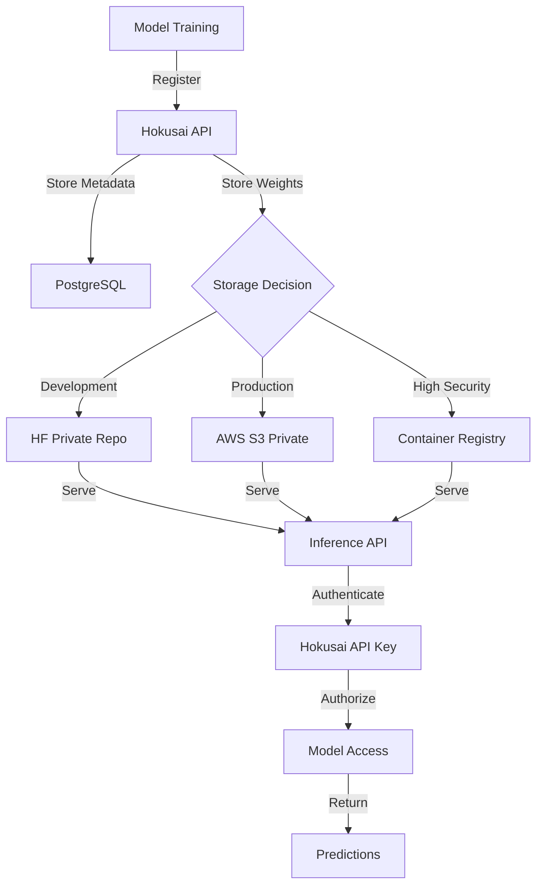

# HuggingFace Hub Security Analysis for Hokusai Models

## Table of Contents
1. [Overview](#overview)
2. [Security Implications](#security-implications)
3. [Access Control](#access-control)
4. [Implementation Strategy](#implementation-strategy)
5. [Alternative Solutions](#alternative-solutions)

---

## Overview

When a model is registered in Hokusai (e.g., Sales Lead Scoring Model ID 21), we need to consider how and where to store the model artifacts for serving.

## Security Implications

### 🔴 Critical Security Concerns with HuggingFace Hub

#### 1. **Public vs Private Repositories**

| Type | Visibility | Security | Cost |
|------|-----------|----------|------|
| **Public Repo** | Anyone can download | ❌ NO security | Free |
| **Private Repo** | Only authorized users | ✅ Controlled access | $9-20/month per user |
| **Gated Repo** | Request-based access | ⚠️ Semi-public | Free |

#### 2. **What Gets Exposed**

When you upload to HuggingFace Hub, you expose:
- **Model weights** (the trained parameters)
- **Model architecture** (can be reverse-engineered)
- **Training configuration** (if included)
- **Dataset information** (if in model card)
- **Performance metrics** (if documented)

#### 3. **Who Has Access**

**Public Repository:**
```
ANYONE → Can download your model
ANYONE → Can fine-tune it
ANYONE → Can use it commercially (unless licensed)
COMPETITORS → Can analyze your model
```

**Private Repository:**
```
Only users you explicitly grant access
Your organization members
HuggingFace staff (for support/debugging)
```

---

## Access Control

### HuggingFace Private Repository Access Levels

```python
# Access control for private repos
{
    "owner": "Full control (read, write, delete)",
    "write": "Can push updates to model",
    "read": "Can download and use model",
    "none": "No access"
}
```

### Security Best Practices

1. **Never upload sensitive data in model metadata**
2. **Use private repos for proprietary models**
3. **Implement token-based access**
4. **Rotate API keys regularly**
5. **Audit access logs**

---

## Implementation Strategy

### Option 1: Private HuggingFace Hub (Recommended for Testing)

```python
# Secure upload implementation
import os
from huggingface_hub import HfApi, create_repo, upload_file
from typing import Optional

class SecureModelUploader:
    """Securely upload models to HuggingFace Hub."""

    def __init__(self, token: str, organization: Optional[str] = None):
        self.api = HfApi(token=token)
        self.organization = organization or "hokusai-protocol"

    def upload_model_to_private_repo(
        self,
        model_id: str,
        model_path: str,
        model_name: str
    ):
        """Upload model to a PRIVATE HuggingFace repository."""

        # Create private repository
        repo_id = f"{self.organization}/hokusai-model-{model_id}"

        try:
            create_repo(
                repo_id=repo_id,
                private=True,  # CRITICAL: Must be True
                repo_type="model",
                exist_ok=True
            )

            # Upload model files
            upload_file(
                path_or_fileobj=model_path,
                path_in_repo="pytorch_model.bin",
                repo_id=repo_id,
                repo_type="model"
            )

            # Create access token for this specific model
            # This allows us to give model-specific access
            access_config = {
                "repo_id": repo_id,
                "token_name": f"hokusai-model-{model_id}-access",
                "permission": "read"  # Read-only for inference
            }

            print(f"✅ Model {model_id} uploaded to PRIVATE repo: {repo_id}")
            return repo_id

        except Exception as e:
            print(f"❌ Failed to upload: {e}")
            raise
```

### Option 2: AWS S3 (Recommended for Production)

```python
class S3ModelStorage:
    """Store models in AWS S3 with fine-grained access control."""

    def upload_model_to_s3(self, model_id: str, model_path: str):
        """Upload model to private S3 bucket."""

        bucket_name = "hokusai-models-private"
        key = f"models/{model_id}/model.pkl"

        # Upload with server-side encryption
        s3_client.upload_file(
            model_path,
            bucket_name,
            key,
            ExtraArgs={
                'ServerSideEncryption': 'aws:kms',
                'SSEKMSKeyId': 'arn:aws:kms:...',
                'ACL': 'private'
            }
        )

        # Generate presigned URL for serving (expires in 1 hour)
        url = s3_client.generate_presigned_url(
            'get_object',
            Params={'Bucket': bucket_name, 'Key': key},
            ExpiresIn=3600
        )

        return url
```

### Option 3: Private Container Registry

```python
class ContainerizedModel:
    """Package model in Docker container for maximum security."""

    def containerize_model(self, model_id: str):
        """Package model in a private container."""

        dockerfile = f"""
        FROM python:3.9-slim

        # Copy model (never exposed)
        COPY model.pkl /app/model.pkl

        # Inference server
        COPY server.py /app/server.py

        # Model is only accessible through API
        EXPOSE 8080
        CMD ["python", "/app/server.py"]
        """

        # Push to private registry
        registry = "your-private-registry.com"
        image_tag = f"{registry}/hokusai-model-{model_id}:latest"

        return image_tag
```

---

## Alternative Solutions

### Comparison Table

| Solution | Security | Cost | Complexity | Latency |
|----------|----------|------|------------|---------|
| **HF Public Repo** | ❌ None | Free | Low | Medium |
| **HF Private Repo** | ⚠️ Medium | $20/mo | Low | Medium |
| **AWS S3 + Presigned URLs** | ✅ High | ~$5/mo | Medium | Low |
| **Private Docker Registry** | ✅ Very High | ~$20/mo | High | Low |
| **On-Premise Storage** | ✅ Maximum | Hardware cost | High | Lowest |

---

## Recommended Architecture for Hokusai



---

## Security Recommendations

### For Development/Testing:
1. Use HuggingFace **private** repositories
2. Create organization account: `hokusai-protocol`
3. Implement token rotation every 30 days
4. Audit access logs weekly

### For Production:
1. **DO NOT** use public HuggingFace repos for proprietary models
2. Use AWS S3 with KMS encryption
3. Implement presigned URLs with short expiration
4. Consider on-premise storage for highly sensitive models
5. Package models in containers for additional isolation

### For Model ID 21 (Sales Lead Scoring):
```python
# Recommended approach
if environment == "development":
    storage = "huggingface_private"
    repo_id = "hokusai-protocol/sales-lead-scorer-v1"
    private = True
elif environment == "production":
    storage = "aws_s3"
    bucket = "hokusai-models-private"
    encryption = "aws:kms"
else:
    storage = "local"  # For testing only
```

---

## Implementation Code

### When Model is Registered in Hokusai:

```python
async def register_and_upload_model(
    model_id: str,
    model_path: str,
    metadata: dict
):
    """Register model in Hokusai and upload to secure storage."""

    # Step 1: Register in database
    db.register_model(model_id, metadata)

    # Step 2: Determine storage based on sensitivity
    if metadata.get("sensitivity") == "high":
        # Use S3 for sensitive models
        storage_url = await upload_to_s3(model_id, model_path)
        storage_type = "s3"
    elif metadata.get("public_ok", False):
        # Only if explicitly marked as public
        storage_url = await upload_to_hf_public(model_id, model_path)
        storage_type = "huggingface_public"
    else:
        # Default to private HF repo
        storage_url = await upload_to_hf_private(model_id, model_path)
        storage_type = "huggingface_private"

    # Step 3: Update database with storage location
    db.update_model_storage(
        model_id,
        storage_type=storage_type,
        storage_url=storage_url,
        access_token=generate_access_token()
    )

    # Step 4: Set up access controls
    setup_model_permissions(model_id, metadata.get("allowed_users", []))

    return {
        "model_id": model_id,
        "storage": storage_type,
        "status": "registered",
        "access": "restricted"
    }
```

---

## Cost Analysis

### Monthly Costs for Model Storage:

| Storage Method | 10 Models | 100 Models | 1000 Models |
|----------------|-----------|------------|-------------|
| HF Public | $0 | $0 | $0 (❌ Not secure) |
| HF Private | $20 | $20 | $20 (org account) |
| AWS S3 | $5 | $50 | $500 |
| Container Registry | $20 | $100 | $500 |

---

## Conclusion

For Hokusai's Sales Lead Scoring Model (ID 21):

1. **Do NOT use public HuggingFace repos** - Your competitors would have access
2. **For testing**: Use HuggingFace private repositories ($20/month)
3. **For production**: Use AWS S3 with encryption (~$5-50/month)
4. **Access control**: Always through Hokusai API keys, never direct HF tokens to clients
5. **Monitor**: Implement logging for all model access

The model should be uploaded automatically when registered, with the storage location determined by security requirements and environment.