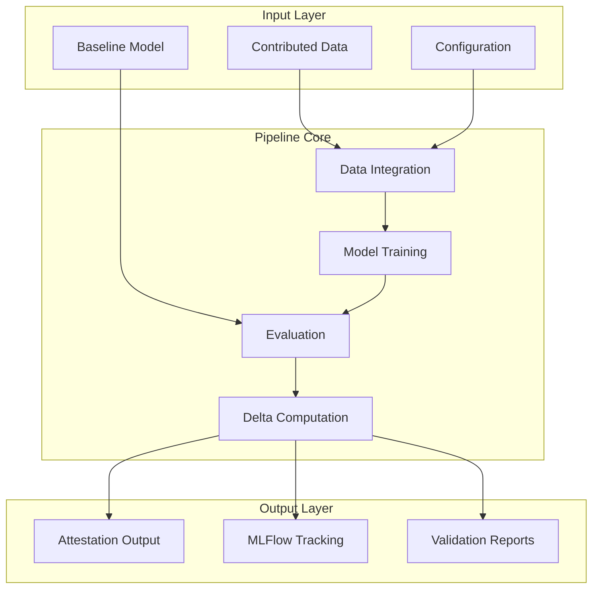
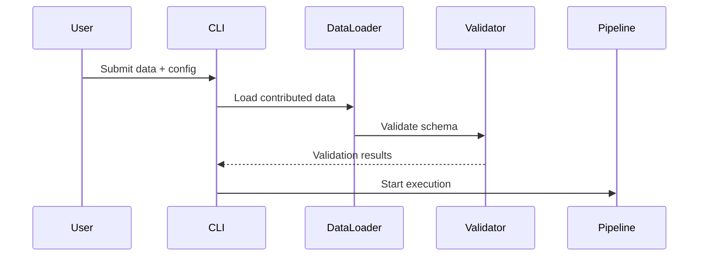
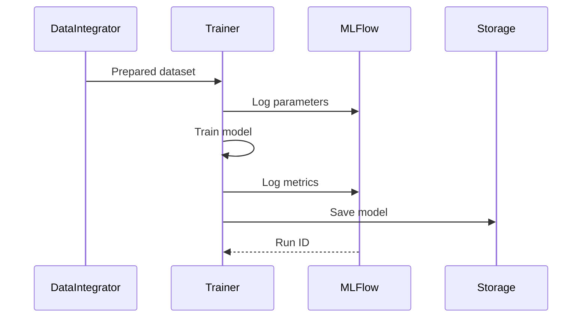
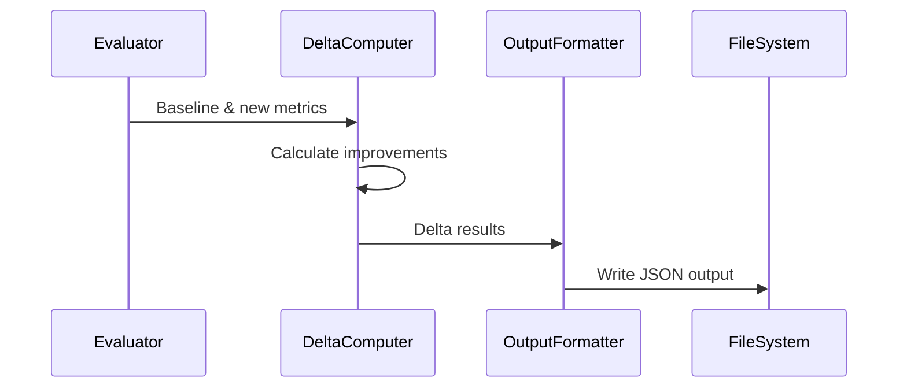
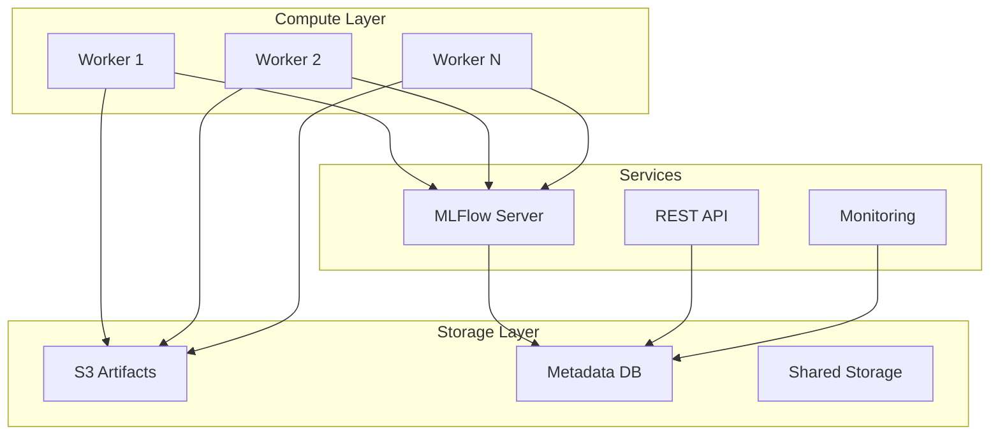

# Architecture Overview

## System Design

The Hokusai data pipeline is a modular, scalable system designed to evaluate machine learning model improvements using contributed data. It produces attestation-ready outputs suitable for zero-knowledge proof generation.

## High-Level Architecture



## Core Components

### 1. Data Integration Module

**Purpose**: Handles all aspects of contributed data processing

**Key Features**:
- Multi-format support (CSV, JSON, Parquet)
- Automatic schema validation
- PII detection and hashing
- Data quality scoring
- Deduplication strategies

**Location**: `src/modules/data_integration.py`

### 2. Model Training Module

**Purpose**: Trains new models with integrated data

**Key Features**:
- Configurable training algorithms
- Hyperparameter optimization
- Distributed training support
- Model versioning
- Checkpoint management

**Location**: `src/modules/model_training.py`

### 3. Evaluation Module

**Purpose**: Compares model performance

**Key Features**:
- Multiple metric support (accuracy, F1, AUROC)
- Stratified evaluation
- Statistical significance testing
- Benchmark dataset management

**Location**: `src/modules/evaluation.py`

### 4. Pipeline Orchestrator

**Purpose**: Coordinates all pipeline steps using Metaflow

**Key Features**:
- Step dependency management
- Parallel execution
- Failure recovery
- Resource allocation
- Progress tracking

**Location**: `src/pipeline/hokusai_pipeline.py`

## Data Flow

### 1. Input Processing



### 2. Model Training Flow



### 3. Evaluation and Output



## Technology Stack

### Core Technologies

| Component | Technology | Purpose |
|-----------|------------|---------|
| Language | Python 3.8+ | Primary implementation |
| Orchestration | Metaflow | Pipeline management |
| Tracking | MLFlow | Experiment tracking |
| Data Processing | Pandas | Data manipulation |
| ML Framework | Scikit-learn | Model training |
| Testing | Pytest | Unit/integration tests |

### Supporting Libraries

| Library | Purpose |
|---------|---------|
| NumPy | Numerical operations |
| Pydantic | Data validation |
| Click | CLI interface |
| python-dotenv | Environment management |

## Design Principles

### 1. Modularity

Each component is self-contained with clear interfaces:

```python
class DataIntegrator:
    def load_data(self, path: Path) -> pd.DataFrame
    def validate_schema(self, data: pd.DataFrame) -> bool
    def integrate_datasets(self, base: pd.DataFrame, new: pd.DataFrame) -> pd.DataFrame
```

### 2. Reproducibility

- Fixed random seeds throughout
- Deterministic data processing
- Version-locked dependencies
- Immutable configuration

### 3. Scalability

- Lazy data loading
- Batch processing
- Parallel execution where possible
- Configurable resource limits

### 4. Observability

- Comprehensive logging
- Metric tracking
- Performance profiling
- Error reporting

## Security Considerations

### Data Privacy

1. **PII Protection**
   - Automatic detection of sensitive fields
   - One-way hashing for identifiers
   - No plaintext storage of personal data

2. **Access Control**
   - File system permissions
   - API key management
   - Secure configuration handling

### Attestation Security

1. **Data Integrity**
   - SHA-256 hashing of all inputs
   - Merkle tree construction
   - Tamper-evident outputs

2. **Proof Generation**
   - Deterministic computation
   - Verifiable results
   - Circuit-compatible formatting

## Performance Architecture

### Optimization Strategies

1. **Memory Efficiency**
   - Streaming data processing
   - Garbage collection tuning
   - Memory-mapped files for large datasets

2. **Compute Optimization**
   - Vectorized operations
   - GPU acceleration support
   - Distributed processing

3. **I/O Optimization**
   - Async file operations
   - Compression for storage
   - Caching frequently accessed data

### Benchmarks

| Operation | Small (1K) | Medium (100K) | Large (1M) |
|-----------|------------|---------------|------------|
| Data Load | < 1s | < 10s | < 60s |
| Training | < 5s | < 5m | < 30m |
| Evaluation | < 2s | < 30s | < 3m |
| Full Pipeline | < 10s | < 10m | < 45m |

## Extension Points

### Custom Model Integration

```python
from src.modules.base import BaseModel

class CustomModel(BaseModel):
    def train(self, data: pd.DataFrame) -> None:
        # Implementation
        
    def predict(self, data: pd.DataFrame) -> np.ndarray:
        # Implementation
```

### Custom Metrics

```python
from src.modules.evaluation import register_metric

@register_metric("custom_score")
def custom_metric(y_true, y_pred):
    # Implementation
    return score
```

### Pipeline Hooks

```python
from src.pipeline import register_hook

@register_hook("pre_training")
def custom_preprocessing(data):
    # Modify data before training
    return processed_data
```

## Deployment Architecture

### Local Development

```
hokusai-pipeline/
├── venv/              # Virtual environment
├── mlruns/            # MLFlow tracking
├── outputs/           # Pipeline outputs
└── data/              # Local data storage
```

### Production Deployment



## Next Steps

- [Component Details](./components.md) - Deep dive into each module
- [Data Flow](./data-flow.md) - Detailed data processing pipeline
- [Security Model](./security.md) - Security architecture details
- [Performance Tuning](../operations/performance-tuning.md) - Optimization guide