# DeltaOne Detection System

DeltaOne is Hokusai's automatic improvement detection system that identifies when model performance improves by at least 1 percentage point, triggering token rewards for contributors.

## What is DeltaOne?

DeltaOne represents a significant, measurable improvement in model performance:
- **Threshold**: ≥1 percentage point improvement
- **Automatic**: Detected without manual intervention
- **Verifiable**: Based on standardized benchmarks
- **Rewarded**: Triggers token distribution to contributors

## How It Works

```mermaid
graph LR
    A[Baseline Model] --> B[Contributed Data]
    B --> C[Improved Model]
    C --> D{DeltaOne Check}
    D -->|≥1pp| E[Token Reward]
    D -->|<1pp| F[No Reward]
```



### Detection Process

1. **Baseline Establishment**: A model version is marked with benchmark performance
2. **Improvement Training**: New model trained with contributed data
3. **Performance Comparison**: Compare metrics between versions
4. **DeltaOne Check**: Calculate if improvement ≥ 1 percentage point
5. **Reward Trigger**: If achieved, contributor receives tokens

## Basic Usage

### Simple Detection

```python
from hokusai.evaluation.deltaone_evaluator import detect_delta_one

# Check if the latest version achieves DeltaOne
achieved = detect_delta_one("my-model")

if achieved:
    print("🎉 DeltaOne achieved! Contributors will receive rewards.")
else:
    print("📊 Improvement detected but below DeltaOne threshold.")
```

### Detection with Webhook

```python
# Configure webhook for notifications
achieved = detect_delta_one(
    model_name="sentiment-analyzer",
    webhook_url="https://api.myapp.com/deltaone-webhook"
)
```

### Detailed Detection Results

```python
from hokusai.evaluation.deltaone_evaluator import (
    detect_delta_one_detailed,
    DeltaOneResult
)

# Get detailed results
result: DeltaOneResult = detect_delta_one_detailed("my-model")

print(f"Achieved: {result.achieved}")
print(f"Baseline version: {result.baseline_version}")
print(f"New version: {result.new_version}")
print(f"Metric: {result.metric_name}")
print(f"Baseline value: {result.baseline_value}")
print(f"New value: {result.new_value}")
print(f"Improvement: {result.delta_value:.2f} percentage points")
```

## Configuration

### Metric Configuration

Different metrics require different handling:

```python
from hokusai.evaluation import DeltaOneConfig

# For metrics where higher is better (accuracy, f1_score)
config = DeltaOneConfig(
    metric_direction="maximize",
    threshold=0.01  # 1 percentage point
)

# For metrics where lower is better (error, loss)
config = DeltaOneConfig(
    metric_direction="minimize",
    threshold=-0.01  # 1 percentage point reduction
)

achieved = detect_delta_one("my-model", config=config)
```

### Custom Thresholds

While DeltaOne standard is 1 percentage point, you can configure custom thresholds:

```python
# Require 2 percentage point improvement
config = DeltaOneConfig(threshold=0.02)

# For small-value metrics, use absolute thresholds
config = DeltaOneConfig(
    threshold=0.001,  # 0.1 percentage point
    metric_type="small_value"  # For metrics typically < 0.1
)
```

## Integration Examples

### With Model Training

```python
import mlflow
from hokusai.core import ModelRegistry
from hokusai.evaluation.deltaone_evaluator import detect_delta_one

def train_with_contributed_data(base_model, contributed_data):
    """Train model with new data and check for DeltaOne."""
    
    registry = ModelRegistry()
    
    with mlflow.start_run() as run:
        # Train improved model
        improved_model = base_model.fit(contributed_data)
        
        # Calculate metrics
        metrics = evaluate_model(improved_model)
        
        # Log metrics
        for metric_name, value in metrics.items():
            mlflow.log_metric(metric_name, value)
        
        # Log model
        mlflow.sklearn.log_model(improved_model, "model")
        
        # Register with Hokusai
        registry.register_tokenized_model(
            model_uri=f"runs:/{run.info.run_id}/model",
            name="my-classifier",
            token_id="CLASS-001",
            benchmark_metric="accuracy",
            benchmark_value=str(metrics["accuracy"])
        )
    
    # Check for DeltaOne
    if detect_delta_one("my-classifier"):
        reward_contributor(contributed_data.contributor_address)
```

### Automated Pipeline Integration

```python
from metaflow import FlowSpec, step
from hokusai.evaluation.deltaone_evaluator import detect_delta_one

class ModelImprovementFlow(FlowSpec):
    
    @step
    def start(self):
        """Load baseline model and contributed data."""
        self.model_name = "text-classifier"
        self.next(self.train_improved)
    
    @step
    def train_improved(self):
        """Train with contributed data."""
        # Training logic here
        self.improved_accuracy = 0.87  # Example
        self.next(self.check_deltaone)
    
    @step
    def check_deltaone(self):
        """Check if DeltaOne achieved."""
        self.deltaone_achieved = detect_delta_one(self.model_name)
        self.next(self.reward_contributor)
    
    @step
    def reward_contributor(self):
        """Trigger reward if DeltaOne achieved."""
        if self.deltaone_achieved:
            print("Triggering token reward!")
            # Reward logic here
        self.next(self.end)
    
    @step
    def end(self):
        """Pipeline complete."""
        pass
```

## Metric Calculations

### Percentage Point vs Percentage Change

DeltaOne uses **percentage points**, not percentage change:

```python
# Example: Accuracy improvement
baseline_accuracy = 0.85  # 85%
new_accuracy = 0.87       # 87%

# Percentage POINTS (what DeltaOne uses)
pp_improvement = new_accuracy - baseline_accuracy  # 0.02 = 2pp ✓

# Percentage CHANGE (not used)
pct_change = (new_accuracy - baseline_accuracy) / baseline_accuracy  # 0.0235 = 2.35%
```

### Supported Metrics

DeltaOne works with any numeric metric:

```python
SUPPORTED_METRICS = {
    # Classification
    "accuracy": "maximize",
    "precision": "maximize",
    "recall": "maximize",
    "f1_score": "maximize",
    
    # Regression  
    "rmse": "minimize",
    "mae": "minimize",
    "r2_score": "maximize",
    
    # NLP
    "bleu_score": "maximize",
    "perplexity": "minimize",
    "rouge_score": "maximize",
    
    # Custom
    "reply_rate": "maximize",
    "conversion_rate": "maximize",
    "engagement_score": "maximize"
}
```

## Webhook Integration

### Webhook Payload

When DeltaOne is achieved, the webhook receives:

```json
{
    "model_name": "sentiment-analyzer",
    "delta_value": 0.015,
    "baseline_version": "1",
    "new_version": "2",
    "metric_name": "f1_score",
    "baseline_value": 0.825,
    "current_value": 0.840,
    "contributor_address": "0x742d35Cc6634C0532925a3b844Bc9e7595f5b4e1",
    "timestamp": "2024-01-15T10:30:00Z"
}
```

### Webhook Configuration

```python
from hokusai.evaluation.deltaone_evaluator import (
    detect_delta_one,
    WebhookConfig
)

# Configure webhook with retry logic
webhook_config = WebhookConfig(
    url="https://api.myapp.com/deltaone",
    headers={"Authorization": "Bearer token123"},
    max_retries=3,
    timeout=10
)

achieved = detect_delta_one(
    "my-model",
    webhook_config=webhook_config
)
```

## Advanced Usage

### Batch Detection

Check multiple models for DeltaOne:

```python
from hokusai.evaluation.deltaone_evaluator import batch_detect_delta_one

models = ["model-a", "model-b", "model-c"]
results = batch_detect_delta_one(models)

for model_name, achieved in results.items():
    if achieved:
        print(f"✅ {model_name} achieved DeltaOne!")
```

### Historical Analysis

Analyze DeltaOne achievements over time:

```python
from hokusai.evaluation.deltaone_evaluator import get_deltaone_history

history = get_deltaone_history("sentiment-analyzer")

for achievement in history:
    print(f"Version {achievement.version}:")
    print(f"  - Date: {achievement.timestamp}")
    print(f"  - Improvement: {achievement.delta_value:.3f}pp")
    print(f"  - Contributor: {achievement.contributor}")
```

### Custom Evaluation

Implement custom DeltaOne logic:

```python
from hokusai.evaluation.deltaone_evaluator import DeltaOneEvaluator

class CustomDeltaOneEvaluator(DeltaOneEvaluator):
    
    def calculate_delta(self, baseline_value, new_value, metric_name):
        """Custom delta calculation."""
        if metric_name == "custom_metric":
            # Special handling for custom metric
            return (new_value - baseline_value) * 100
        return super().calculate_delta(baseline_value, new_value, metric_name)
    
    def is_significant_improvement(self, delta, metric_name):
        """Custom significance check."""
        if metric_name == "custom_metric":
            return delta >= 0.5  # 0.5pp for custom metric
        return delta >= 0.01  # Default 1pp

evaluator = CustomDeltaOneEvaluator()
achieved = evaluator.detect("my-model")
```

## Best Practices

### 1. Consistent Benchmarking

Always use the same test dataset for evaluation:

```python
# Store test data hash with model
tags = {
    "test_data_hash": "sha256:abc123...",
    "test_data_size": "10000",
    "benchmark_metric": "f1_score",
    "benchmark_value": "0.85"
}
```

### 2. Multiple Metrics

Track multiple metrics but designate one for DeltaOne:

```python
# Register with primary metric
registry.register_tokenized_model(
    model_uri=model_uri,
    name="multi-metric-model",
    token_id="MULTI-001",
    benchmark_metric="f1_score",  # Primary for DeltaOne
    benchmark_value="0.85",
    tags={
        "accuracy": "0.87",        # Additional metrics
        "precision": "0.84",
        "recall": "0.86"
    }
)
```

### 3. Contributor Attribution

Always track contributor information:

```python
with mlflow.start_run() as run:
    # Log contributor info
    mlflow.set_tag("contributor_address", contributor_eth_address)
    mlflow.set_tag("contribution_type", "labeled_data")
    mlflow.set_tag("contribution_size", "5000_samples")
    
    # Train and register model
    # ...
    
# DeltaOne detection will include contributor info
```

## Troubleshooting

### Common Issues

**No baseline version found**
```python
# Ensure at least one version has benchmark tags
registry.register_tokenized_model(
    ...,
    benchmark_metric="accuracy",
    benchmark_value="0.85"  # Must be present
)
```

**Metric not found in run**
```python
# Log metrics during training
mlflow.log_metric("accuracy", accuracy_value)
mlflow.log_metric("f1_score", f1_value)
```

**Webhook failures**
```python
# Check webhook logs
from hokusai.evaluation.deltaone_evaluator import get_webhook_logs

logs = get_webhook_logs("my-model")
for log in logs:
    print(f"{log.timestamp}: {log.status} - {log.message}")
```

## Related Topics

- [Model Registry](./model-registry.md) - Managing model versions
- [Metric Logging](./metric-logging.md) - Standardized metric tracking
- [Reward Distribution](../guides/reward-distribution.md) - How tokens are distributed