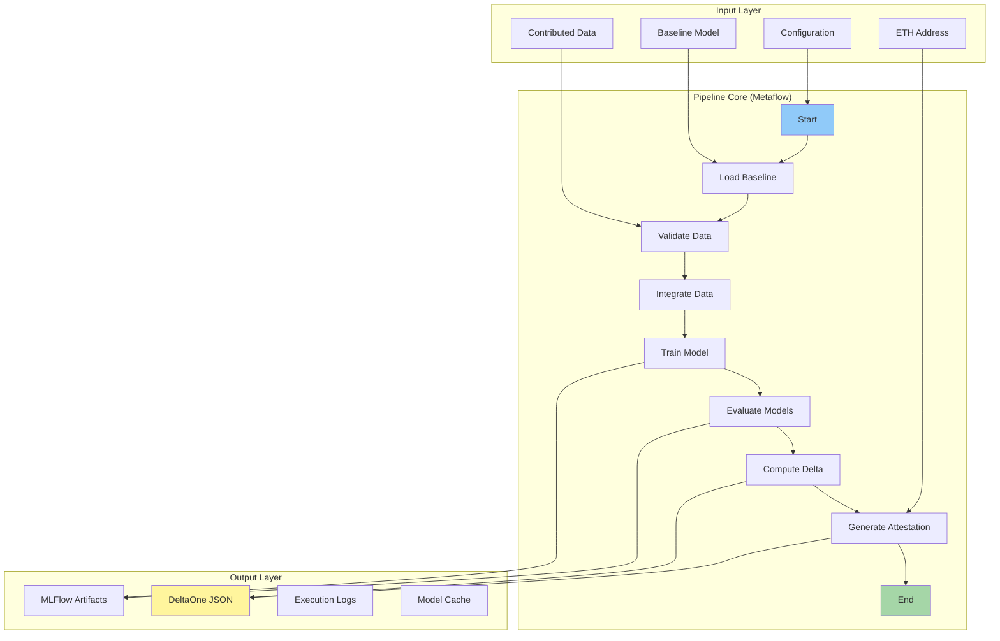

# Data Pipeline Architecture

The Hokusai data pipeline is a Metaflow-based system designed to evaluate machine learning model improvements using contributed data. It produces cryptographically verifiable attestations suitable for blockchain integration.

## System Overview



## Core Components

### 1. Pipeline Orchestrator (`hokusai_pipeline.py`)

The main Metaflow pipeline that coordinates all steps:

```python
class HokusaiPipeline(FlowSpec):
    """Main pipeline orchestrating model evaluation"""
    
    @step
    def start(self):
        """Initialize pipeline with configuration"""
        self.config = load_config()
        self.mlflow_run_id = start_mlflow_run()
        self.next(self.load_baseline_model)
    
    @step
    def load_baseline_model(self):
        """Load or create baseline model"""
        # Implementation details...
        self.next(self.validate_contributed_data)
```

### 2. Data Integration Module

Handles all data processing operations:

```python
class DataIntegrator:
    """Manages data loading, validation, and integration"""
    
    def validate_schema(self, data: pd.DataFrame) -> bool:
        """Ensure data matches expected schema"""
        
    def detect_pii(self, data: pd.DataFrame) -> Dict[str, List[str]]:
        """Scan for personally identifiable information"""
        
    def integrate_datasets(
        self, 
        baseline: pd.DataFrame, 
        contributed: pd.DataFrame
    ) -> pd.DataFrame:
        """Merge contributed data with baseline training set"""
```

#### Key Features:
- **Multi-format Support**: CSV, JSON, Parquet
- **Schema Validation**: Ensures data consistency
- **PII Detection**: Automatic sensitive data scanning
- **Deduplication**: Removes redundant entries
- **Quality Scoring**: Assesses data contribution value

### 3. Model Training Module

Manages model training with contributed data:

```python
class ModelTrainer:
    """Handles model training operations"""
    
    def train_model(
        self, 
        data: pd.DataFrame, 
        config: TrainingConfig
    ) -> Model:
        """Train model with specified configuration"""
        
    def save_checkpoint(self, model: Model, iteration: int):
        """Save training checkpoint for recovery"""
```

#### Training Features:
- **Deterministic Training**: Fixed seeds for reproducibility
- **Hyperparameter Management**: Configurable training params
- **Checkpoint System**: Resume from failures
- **Multi-framework Support**: TensorFlow, PyTorch, scikit-learn

### 4. Evaluation Module

Compares model performance:

```python
class Evaluator:
    """Evaluates and compares model performance"""
    
    def evaluate_model(
        self, 
        model: Model, 
        test_data: pd.DataFrame
    ) -> Dict[str, float]:
        """Calculate performance metrics"""
        
    def compare_models(
        self, 
        baseline_metrics: Dict, 
        new_metrics: Dict
    ) -> DeltaResult:
        """Compute performance improvements"""
```

#### Metrics Calculated:
- **Classification**: Accuracy, Precision, Recall, F1, AUROC
- **Regression**: MSE, MAE, R², MAPE
- **Custom Metrics**: Domain-specific evaluations

### 5. Attestation Generator

Creates verifiable outputs:

```python
class AttestationGenerator:
    """Generates ZK-proof ready attestations"""
    
    def generate_attestation(
        self,
        delta_result: DeltaResult,
        contributor_info: ContributorInfo,
        pipeline_metadata: PipelineMetadata
    ) -> Attestation:
        """Create cryptographically verifiable attestation"""
```

## Pipeline Flow Details

### Step 1: Initialization
```python
@step
def start(self):
    """Pipeline initialization"""
    # Load configuration
    self.config = load_pipeline_config()
    
    # Set random seeds
    set_random_seeds(self.config.random_seed)
    
    # Initialize MLFlow
    self.mlflow_run_id = init_mlflow_tracking()
    
    self.next(self.load_baseline_model)
```

### Step 2: Load Baseline Model
```python
@step
def load_baseline_model(self):
    """Load existing baseline or create mock"""
    if self.dry_run:
        self.baseline_model = create_mock_baseline()
    else:
        self.baseline_model = load_model(self.baseline_path)
    
    # Log baseline metrics
    log_baseline_metrics(self.baseline_model)
    
    self.next(self.validate_contributed_data)
```

### Step 3: Data Validation
```python
@step
def validate_contributed_data(self):
    """Validate and prepare contributed data"""
    # Load data
    data = load_contributed_data(self.contributed_data_path)
    
    # Validate schema
    validate_schema(data)
    
    # Check for PII
    pii_report = detect_pii(data)
    if pii_report.has_pii:
        data = hash_pii_fields(data, pii_report)
    
    # Quality checks
    self.data_quality_score = assess_data_quality(data)
    
    self.validated_data = data
    self.next(self.integrate_data)
```

### Step 4: Data Integration
```python
@step
def integrate_data(self):
    """Merge contributed data with training set"""
    # Load baseline training data
    baseline_data = load_baseline_training_data()
    
    # Integrate datasets
    integrated_data = integrate_datasets(
        baseline_data, 
        self.validated_data
    )
    
    # Apply sampling if needed
    if len(integrated_data) > self.config.max_samples:
        integrated_data = stratified_sample(
            integrated_data, 
            self.config.max_samples
        )
    
    self.training_data = integrated_data
    self.next(self.train_model)
```

### Step 5: Model Training
```python
@step
def train_model(self):
    """Train improved model with integrated data"""
    # Initialize trainer
    trainer = ModelTrainer(self.config.training_config)
    
    # Train model
    self.improved_model = trainer.train(
        self.training_data,
        callbacks=[
            MLFlowCallback(),
            CheckpointCallback()
        ]
    )
    
    # Save model artifacts
    save_model_artifacts(self.improved_model)
    
    self.next(self.evaluate_models)
```

### Step 6: Evaluation
```python
@step
def evaluate_models(self):
    """Evaluate both models on benchmark"""
    # Load evaluation dataset
    eval_data = load_evaluation_data()
    
    # Evaluate baseline
    self.baseline_metrics = evaluate_model(
        self.baseline_model, 
        eval_data
    )
    
    # Evaluate improved model
    self.improved_metrics = evaluate_model(
        self.improved_model, 
        eval_data
    )
    
    # Log to MLFlow
    log_evaluation_results(
        self.baseline_metrics, 
        self.improved_metrics
    )
    
    self.next(self.compute_delta)
```

### Step 7: Delta Computation
```python
@step
def compute_delta(self):
    """Calculate performance improvements"""
    # Compute deltas
    self.delta_result = compute_metric_deltas(
        self.baseline_metrics,
        self.improved_metrics
    )
    
    # Statistical significance
    self.significance = test_significance(
        self.baseline_metrics,
        self.improved_metrics,
        self.eval_data
    )
    
    # Aggregate improvement score
    self.delta_one_score = calculate_delta_one_score(
        self.delta_result
    )
    
    self.next(self.generate_attestation)
```

### Step 8: Attestation Generation
```python
@step
def generate_attestation(self):
    """Create final attestation output"""
    # Prepare contributor info
    contributor = ContributorInfo(
        address=self.contributor_address,
        data_hash=hash_data(self.validated_data),
        sample_count=len(self.validated_data)
    )
    
    # Generate attestation
    attestation = generate_attestation(
        delta_result=self.delta_result,
        contributor_info=contributor,
        pipeline_metadata=self.get_metadata()
    )
    
    # Write output
    write_attestation_output(attestation, self.output_dir)
    
    self.next(self.end)
```

## Configuration System

### Pipeline Configuration
```yaml
pipeline:
  name: "hokusai-evaluation"
  version: "1.0.0"
  random_seed: 42
  
metaflow:
  max_workers: 4
  max_retry_count: 3
  
training:
  framework: "scikit-learn"
  model_type: "RandomForestClassifier"
  hyperparameters:
    n_estimators: 100
    max_depth: 10
    
evaluation:
  test_split: 0.2
  stratify: true
  metrics:
    - accuracy
    - precision
    - recall
    - f1_score
    - auroc
```

### Environment Variables
```bash
# Core settings
HOKUSAI_CONFIG_PATH=./config/pipeline.yaml
HOKUSAI_OUTPUT_DIR=./outputs
HOKUSAI_LOG_LEVEL=INFO

# MLFlow settings
MLFLOW_TRACKING_URI=./mlruns
MLFLOW_EXPERIMENT_NAME=hokusai-evaluation

# Performance settings
METAFLOW_MEMORY=8192
METAFLOW_CPU=4
```

## Error Handling

### Retry Logic
```python
@retry(times=3, minutes_between_retries=1)
@step
def train_model(self):
    """Training with automatic retry on failure"""
    try:
        self.model = train_model(self.data)
    except MemoryError:
        # Reduce batch size and retry
        self.config.batch_size //= 2
        raise
    except Exception as e:
        # Log error and fail
        log_error(e)
        raise
```

### Recovery Mechanisms
- **Checkpointing**: Resume from last successful step
- **Partial Results**: Save intermediate outputs
- **Graceful Degradation**: Continue with reduced functionality

## Performance Optimization

### 1. Data Processing
- **Chunked Reading**: Process large files in chunks
- **Parallel Validation**: Multi-threaded data validation
- **Memory Mapping**: Efficient large file handling

### 2. Model Training
- **GPU Acceleration**: Automatic GPU detection and usage
- **Distributed Training**: Multi-node support via Metaflow
- **Mixed Precision**: FP16 training where supported

### 3. Caching Strategy
- **Model Cache**: Reuse loaded models
- **Data Cache**: Cache processed datasets
- **Result Cache**: Store evaluation results

## Monitoring and Observability

### Logging
```python
# Structured logging throughout
logger.info("Training started", extra={
    "model_type": self.config.model_type,
    "data_size": len(self.training_data),
    "run_id": self.mlflow_run_id
})
```

### Metrics Collection
- **Pipeline Metrics**: Step duration, memory usage
- **Model Metrics**: Training loss, validation scores
- **System Metrics**: CPU, memory, disk I/O

### MLFlow Integration
- **Experiment Tracking**: All runs logged
- **Artifact Storage**: Models and data saved
- **Metric Visualization**: Real-time dashboards

## Security Considerations

### Data Security
- **PII Detection**: Automatic scanning and hashing
- **Encryption**: Sensitive data encrypted at rest
- **Access Control**: Role-based permissions

### Pipeline Security
- **Input Validation**: Strict schema enforcement
- **Sandboxing**: Isolated execution environments
- **Audit Logging**: Complete activity trails

## Scalability

### Horizontal Scaling
- **Metaflow**: Native support for distributed execution
- **Data Partitioning**: Process subsets in parallel
- **Model Parallelism**: Distribute model across nodes

### Vertical Scaling
- **Resource Allocation**: Configurable CPU/memory
- **Batch Processing**: Adjustable batch sizes
- **Streaming**: Handle arbitrarily large datasets

## Next Steps

- [Configuration Guide](./configuration.md) - Detailed configuration options
- [Data Formats](./data-formats.md) - Supported data formats and schemas
- [Attestation Details](./attestation.md) - Understanding attestation outputs
- [API Reference](../developer-guide/api-reference.md) - Programmatic usage