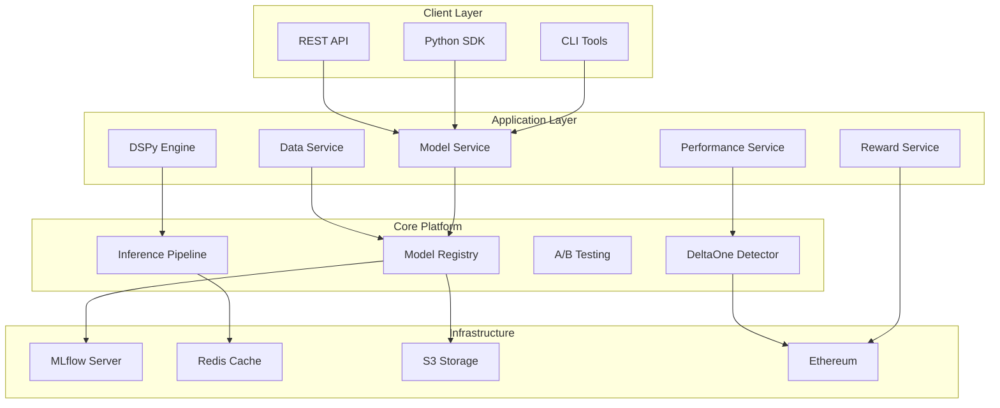
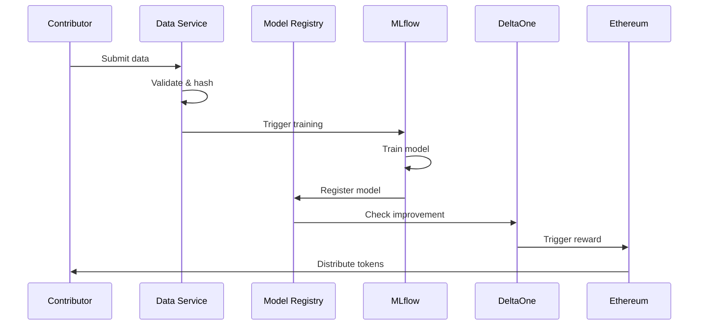
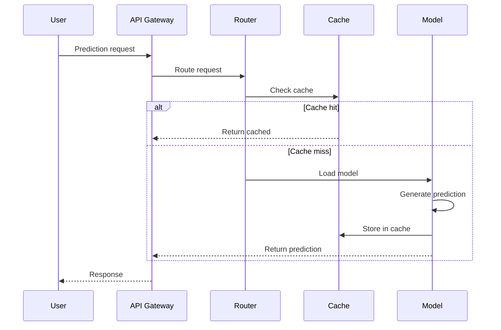
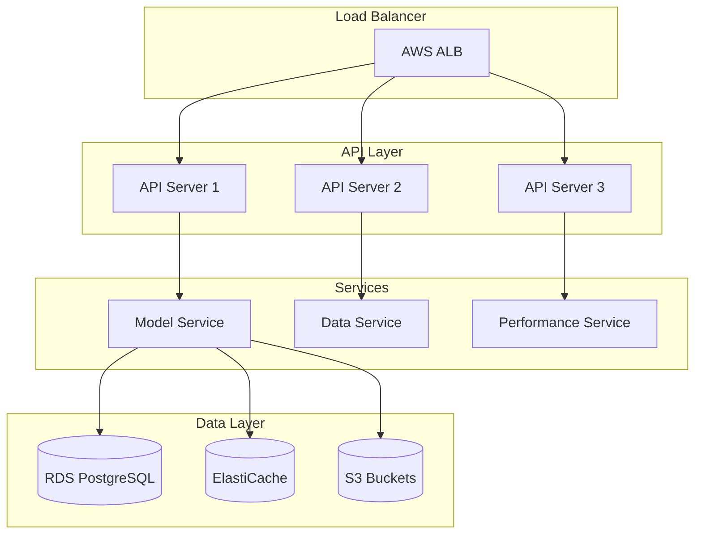
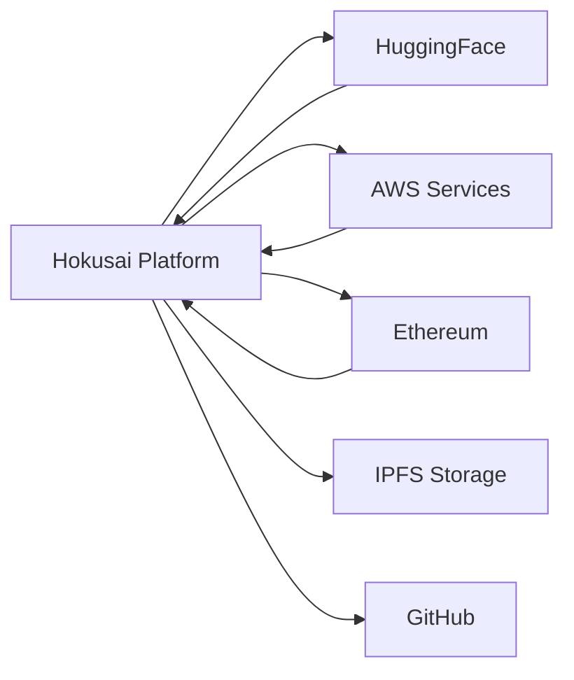

# Architecture Overview

Understanding the Hokusai ML Platform architecture and how components work together.

## System Architecture



## Core Components

### 1. Model Registry

The Model Registry is the heart of Hokusai, extending MLflow with blockchain awareness:

```python
# Architecture
ModelRegistry
├── MLflowClient (base registry)
├── TokenValidator (blockchain integration)
├── MetadataManager (Hokusai-specific tags)
└── VersionController (version management)
```

**Key Features:**
- Token-aware model registration
- Automatic lineage tracking
- Metadata validation
- Version comparison

### 2. DeltaOne Detection Engine

Monitors model improvements and triggers rewards:

```python
# Detection Flow
DeltaOneDetector
├── VersionComparator
│   ├── Load baseline metrics
│   ├── Load new metrics
│   └── Calculate delta
├── ThresholdChecker
│   └── Verify ≥1pp improvement
└── RewardTrigger
    ├── Webhook notifications
    └── Smart contract calls
```

### 3. Inference Pipeline

Handles production model serving with advanced features:

```python
# Pipeline Components
InferencePipeline
├── ModelLoader
│   ├── Cache management
│   └── Lazy loading
├── RequestRouter
│   ├── A/B test logic
│   └── Traffic management
├── PredictionEngine
│   ├── Batch processing
│   └── Result caching
└── MetricsCollector
    └── Performance tracking
```

### 4. Data Contribution System

Manages the complete data contribution lifecycle:

```python
# Contribution Flow
DataContributionSystem
├── DataValidator
│   ├── Format checking
│   ├── Quality assessment
│   └── PII detection
├── ContributionProcessor
│   ├── Data hashing
│   ├── Storage management
│   └── Metadata extraction
└── ImpactTracker
    ├── Model retraining
    └── Performance comparison
```

## Data Flow

### Model Training Flow



### Inference Flow



## Technology Stack

### Core Technologies

| Component | Technology | Purpose |
|-----------|------------|---------|
| API Framework | FastAPI | High-performance async API |
| ML Platform | MLflow | Experiment tracking & model registry |
| Cache | Redis | Model caching & session management |
| Storage | S3/MinIO | Model artifacts & data storage |
| Database | PostgreSQL | Metadata & configuration |
| Container | Docker | Deployment & isolation |
| Orchestration | Kubernetes | Scaling & management |

### Language & Frameworks

- **Python 3.8+**: Core platform language
- **TypeScript**: Frontend & tooling
- **Solidity**: Smart contracts
- **Go**: High-performance services

## Deployment Architecture

### Local Development

```yaml
# docker-compose.yml structure
services:
  api:
    build: .
    ports: ["8000:8000"]
    
  mlflow:
    image: mlflow/mlflow
    ports: ["5000:5000"]
    
  redis:
    image: redis:alpine
    ports: ["6379:6379"]
    
  postgres:
    image: postgres:14
    environment:
      POSTGRES_DB: hokusai
```

### Production Deployment



## Security Architecture

### Authentication & Authorization

```python
# Security Layers
SecurityArchitecture
├── Authentication
│   ├── API Key validation
│   ├── JWT tokens
│   └── ETH signature verification
├── Authorization
│   ├── Role-based access (RBAC)
│   ├── Resource permissions
│   └── Rate limiting
└── Encryption
    ├── TLS for transport
    ├── Encrypted storage
    └── Key management (KMS)
```

### Data Security

- **At Rest**: AES-256 encryption for stored data
- **In Transit**: TLS 1.3 for all communications
- **Access Control**: IAM roles and policies
- **Audit**: Complete audit trail of all operations

## Scaling Considerations

### Horizontal Scaling

```python
# Scalable Components
- API Servers: Stateless, behind load balancer
- Model Servers: Auto-scaling based on load
- Cache Layer: Redis Cluster for distribution
- Storage: S3 with CloudFront CDN
```

### Performance Optimization

1. **Model Caching**
   - Redis for hot models
   - Local memory for frequently used
   - Lazy loading for cold models

2. **Batch Processing**
   - Queue-based job processing
   - Parallel inference pipelines
   - Async request handling

3. **Database Optimization**
   - Read replicas for queries
   - Connection pooling
   - Query optimization

## Integration Points

### External Systems



### Webhook System

```python
# Webhook Events
WebhookEvents
├── model.registered
├── deltaone.achieved
├── contribution.processed
├── reward.distributed
└── test.completed
```

## Monitoring & Observability

### Metrics Collection

```python
# Monitoring Stack
Observability
├── Metrics (Prometheus)
│   ├── API latency
│   ├── Model performance
│   └── Resource usage
├── Logging (ELK Stack)
│   ├── Application logs
│   ├── Audit trails
│   └── Error tracking
└── Tracing (Jaeger)
    ├── Request flow
    └── Performance bottlenecks
```

### Health Checks

```json
{
  "status": "healthy",
  "components": {
    "api": "up",
    "mlflow": "up",
    "redis": "up",
    "database": "up"
  },
  "version": "1.2.3",
  "uptime": "5d 12h 30m"
}
```

## Best Practices

### 1. Service Isolation

Each service should:
- Have a single responsibility
- Communicate via well-defined APIs
- Handle failures gracefully
- Be independently deployable

### 2. Data Consistency

- Use transactions for critical operations
- Implement idempotent APIs
- Handle eventual consistency
- Maintain audit trails

### 3. Performance

- Cache aggressively but invalidate properly
- Use connection pooling
- Implement circuit breakers
- Monitor and alert on anomalies

### 4. Security

- Principle of least privilege
- Defense in depth
- Regular security audits
- Automated vulnerability scanning

## Future Architecture

### Planned Enhancements

1. **Multi-Region Deployment**
   - Global model distribution
   - Regional data compliance
   - Reduced latency

2. **Edge Computing**
   - Model inference at edge
   - Offline capabilities
   - Real-time processing

3. **Federated Learning**
   - Privacy-preserving training
   - Distributed contributions
   - Cross-organizational models

## Related Documentation

- [Deployment Guide](./deployment.md)
- [Security Best Practices](./security.md)
- [Performance Optimization](./performance-optimization.md)
- [API Reference](../api-reference/index.md)