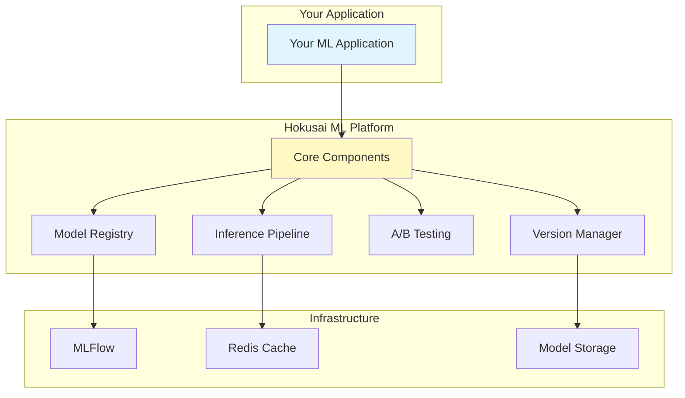

# Hokusai ML Platform Overview

The Hokusai ML Platform is a comprehensive package that extracts the core machine learning capabilities from the Hokusai data pipeline into a reusable, pip-installable library.

> **Note**: The `hokusai-ml-platform` package is currently under development. This documentation describes the planned architecture and APIs.

## Vision

Transform the Hokusai data pipeline's ML infrastructure into a standalone platform that any project can use to:
- Manage model versions and deployments
- Run A/B tests between models
- Track performance improvements
- Generate attestations for contributions
- Build inference pipelines with caching

## Architecture



## Core Components

### 1. Model Registry
Centralized model management with MLFlow integration:
```python
from hokusai.core import ModelRegistry

registry = ModelRegistry()
model_id = registry.register_model(
    model=my_model,
    name="lead-scorer",
    version="1.0.0",
    metrics={"accuracy": 0.92}
)
```

### 2. Version Management
Semantic versioning and rollback capabilities:
```python
from hokusai.core import ModelVersionManager

version_manager = ModelVersionManager(registry)
version_manager.promote_model("lead-scorer", "1.0.0", stage="production")
version_manager.rollback_model("lead-scorer", to_version="0.9.5")
```

### 3. A/B Testing Framework
Compare models in production:
```python
from hokusai.core.ab_testing import ModelTrafficRouter, ABTestConfig

router = ModelTrafficRouter()
test = ABTestConfig(
    model_a="lead-scorer/1.0.0",
    model_b="lead-scorer/1.1.0",
    traffic_split={"a": 0.8, "b": 0.2},
    metrics_to_track=["conversion_rate", "latency"]
)
router.create_test(test)
```

### 4. Inference Pipeline
High-performance inference with caching:
```python
from hokusai.core.inference import HokusaiInferencePipeline

pipeline = HokusaiInferencePipeline(
    registry=registry,
    cache_ttl=300,  # 5 minutes
    enable_batching=True
)
result = pipeline.predict("lead-scorer", data)
```

## Key Features

### 🚀 Production Ready
- Battle-tested components from Hokusai data pipeline
- Comprehensive error handling and logging
- Performance optimized for high throughput
- Built-in monitoring and metrics

### 🔄 Model Lifecycle Management
- Version control for models
- Automated rollback on performance degradation
- Staging environments (dev, staging, production)
- Model lineage tracking

### 📊 Performance Tracking
- Real-time metrics collection
- A/B test statistical analysis
- Performance degradation alerts
- Contribution impact measurement

### 🔐 Security & Compliance
- Model access control
- Audit logging
- PII detection in inputs
- Compliance reporting

### 🎯 Easy Integration
- Simple Python API
- Framework agnostic (TensorFlow, PyTorch, scikit-learn)
- Minimal dependencies
- Extensive documentation

## Installation

### From PyPI (Coming Soon)
```bash
# Basic installation
pip install hokusai-ml-platform

# With ML framework support
pip install hokusai-ml-platform[ml]

# With all features
pip install hokusai-ml-platform[all]
```

### From Source (Current)
```bash
# Clone the repository
git clone https://github.com/Hokusai-protocol/hokusai-data-pipeline.git
cd hokusai-data-pipeline/hokusai-ml-platform

# Install in development mode
pip install -e .
```

## Quick Example

Here's a complete example of using the ML platform:

```python
from hokusai.core import ModelRegistry, ModelVersionManager
from hokusai.core.ab_testing import ModelTrafficRouter, ABTestConfig
from hokusai.core.inference import HokusaiInferencePipeline
from hokusai.tracking import ExperimentManager

# Initialize components
registry = ModelRegistry()
version_manager = ModelVersionManager(registry)
experiment_manager = ExperimentManager(registry)
traffic_router = ModelTrafficRouter()

# Register a baseline model
with experiment_manager.start_experiment("baseline"):
    baseline_id = registry.register_model(
        model=baseline_model,
        name="customer-churn",
        version="1.0.0",
        metrics={"auc": 0.75, "precision": 0.82}
    )

# Train and register improved model
with experiment_manager.start_experiment("improvement-v1"):
    # Train model with contributed data
    improved_model = train_model(contributed_data)
    
    # Register with performance delta
    improved_id = registry.register_improved_model(
        model=improved_model,
        name="customer-churn",
        version="1.1.0",
        baseline_id=baseline_id,
        metrics={"auc": 0.78, "precision": 0.85},
        contributor="0x742d35Cc6634C0532925a3b844Bc9e7595f6234"
    )

# Set up A/B test
ab_test = traffic_router.create_test(
    ABTestConfig(
        model_a="customer-churn/1.0.0",
        model_b="customer-churn/1.1.0",
        traffic_split={"a": 0.9, "b": 0.1},
        duration_hours=24
    )
)

# Use inference pipeline
inference = HokusaiInferencePipeline(registry, traffic_router)
predictions = inference.predict("customer-churn", customer_data)
```

## Platform Benefits

### For ML Engineers
- **Faster Development**: Pre-built components for common ML tasks
- **Best Practices**: Built-in MLOps best practices
- **Flexibility**: Use with any ML framework
- **Scalability**: Production-ready from day one

### For Data Scientists
- **Focus on Models**: Less infrastructure, more modeling
- **Experiment Tracking**: Automatic experiment logging
- **Easy Deployment**: Simple model promotion process
- **Performance Visibility**: Real-time model metrics

### For Organizations
- **Reduced Complexity**: Unified ML infrastructure
- **Cost Effective**: Avoid building from scratch
- **Compliance Ready**: Built-in governance features
- **Future Proof**: Regular updates and improvements

## Integration Examples

### With FastAPI
```python
from fastapi import FastAPI
from hokusai.core.inference import HokusaiInferencePipeline

app = FastAPI()
pipeline = HokusaiInferencePipeline()

@app.post("/predict")
async def predict(data: dict):
    return pipeline.predict("my-model", data)
```

### With Flask
```python
from flask import Flask, request
from hokusai.core.inference import HokusaiInferencePipeline

app = Flask(__name__)
pipeline = HokusaiInferencePipeline()

@app.route("/predict", methods=["POST"])
def predict():
    return pipeline.predict("my-model", request.json)
```

### With Jupyter Notebooks
```python
# In notebook
from hokusai.core import ModelRegistry
from hokusai.tracking import ExperimentManager

registry = ModelRegistry()
exp_manager = ExperimentManager(registry)

# Track experiments
with exp_manager.start_experiment("notebook-exp"):
    # Your model training code
    model = train_model(data)
    registry.register_model(model, "notebook-model", "1.0.0")
```

## Roadmap

### Phase 1: Core Package (Current)
- ✅ Package structure setup
- 🔄 Core component implementation
- 🔄 Basic documentation
- ⏳ Initial tests

### Phase 2: Enhanced Features
- ⏳ Advanced A/B testing strategies
- ⏳ AutoML integration
- ⏳ Multi-model ensembles
- ⏳ Edge deployment support

### Phase 3: Ecosystem Integration
- ⏳ Kubernetes operators
- ⏳ Cloud provider integrations
- ⏳ UI dashboard
- ⏳ Mobile SDK

## Getting Started

1. **Install the Platform**: Follow our [installation guide](./installation.md)
2. **Learn Core Concepts**: Understand the [key components](./core-concepts.md)
3. **Try Examples**: Run the [example notebooks](./examples.md)
4. **Read API Docs**: Explore the [API reference](./api-reference.md)

## Community

- **GitHub**: [hokusai-ml-platform](https://github.com/Hokusai-protocol/hokusai-data-pipeline)
- **Discord**: [Join our community](https://discord.gg/hokusai)
- **Contributing**: See our [contribution guide](../developer-guide/contributing.md)

---

*The Hokusai ML Platform is part of the larger Hokusai Protocol ecosystem. Learn more at [hokusai.io](https://hokusai.io).*