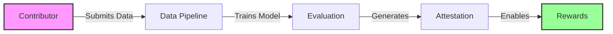
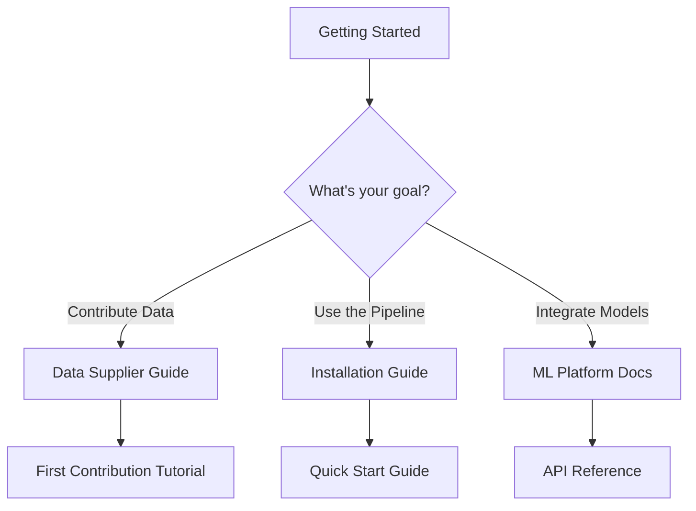

# Introduction to Hokusai

## What is Hokusai?

Hokusai is a decentralized protocol that incentivizes high-quality data contributions to improve AI models. At its core, the Hokusai data pipeline provides a robust, attestation-ready system for evaluating how contributed data improves machine learning models.

## Key Components

### 1. Hokusai Data Pipeline
The core evaluation system that:
- Evaluates model performance improvements from contributed data
- Generates cryptographically verifiable attestations
- Ensures reproducible and deterministic results
- Supports multiple data formats and ML frameworks

### 2. Hokusai ML Platform (Coming Soon)
A planned Python package (`hokusai-ml-platform`) that will provide:
- Reusable ML components for model management
- A/B testing framework for model comparison
- Model registry and versioning system
- Inference pipeline with caching

### 3. Attestation System
- Generates zero-knowledge proof-ready outputs
- Tracks contributor addresses and contribution weights
- Provides verifiable performance improvement metrics
- Enables on-chain reward distribution

## How It Works

1. **Data Contribution**: Contributors submit high-quality datasets
2. **Model Training**: The pipeline trains an improved model using the contributed data
3. **Performance Evaluation**: Compares the new model against a baseline
4. **Attestation Generation**: Creates verifiable proof of improvement
5. **Reward Distribution**: Enables fair compensation based on contribution impact

## Use Cases

### For ML Engineers
- Improve models with community-contributed data
- Track model performance improvements systematically
- Generate verifiable results for stakeholders
- Implement A/B testing for model deployments

### For Data Scientists
- Monetize high-quality datasets
- Contribute to model improvements
- Track contribution impact
- Collaborate with other contributors

### For Organizations
- Source diverse, high-quality training data
- Ensure model improvement transparency
- Implement decentralized ML workflows
- Reduce data acquisition costs

## Getting Started

Choose your path:

### Quick Links
- [Installation Guide](../getting-started/installation.md) - Set up the pipeline
- [Quick Start](../getting-started/quick-start.md) - Run your first evaluation
- [Data Contribution](../getting-started/first-contribution.md) - Submit your first dataset
- [Architecture Overview](./architecture.md) - Understand the system design

## Core Principles

### 1. Reproducibility
Every pipeline run with the same inputs produces identical results through:
- Fixed random seeds
- Deterministic algorithms
- Immutable configurations
- Version-locked dependencies

### 2. Transparency
All improvements are:
- Measurable with standard metrics
- Verifiable through attestations
- Traceable to specific contributions
- Auditable by any participant

### 3. Fairness
Rewards are distributed based on:
- Quantifiable performance improvements
- Contribution quality and uniqueness
- Transparent calculation methods
- Cryptographic verification

### 4. Modularity
The system is designed with:
- Pluggable components
- Extensible interfaces
- Framework-agnostic design
- Easy integration points

## What's Next?

- **New to Hokusai?** Start with our [Installation Guide](../getting-started/installation.md)
- **Ready to contribute?** Check out [First Contribution](../getting-started/first-contribution.md)
- **Want to integrate?** Explore our [Developer Guide](../developer-guide/api-reference.md)
- **Need details?** Dive into the [Architecture Overview](./architecture.md)

## Community and Support

- **GitHub**: [hokusai-data-pipeline](https://github.com/Hokusai-protocol/hokusai-data-pipeline)
- **Documentation**: [docs.hokus.ai](https://docs.hokus.ai)
- **Discord**: Join our community for support
- **Issues**: Report bugs or request features on GitHub

---

*This documentation covers the Hokusai data pipeline v1.0. For protocol-level documentation including tokenomics and governance, visit [docs.hokus.ai](https://docs.hokus.ai).*