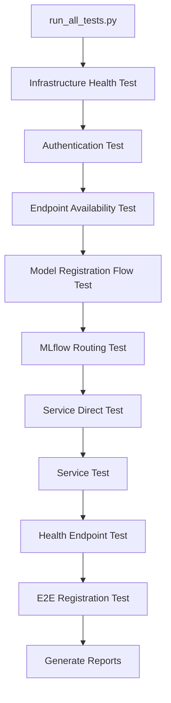

# Model Registration Testing Flow Mapping

## Overview
This document maps the complete testing flow for model registration in the hokusai-data-pipeline after infrastructure migration to a centralized repository. The system uses a comprehensive test suite that validates infrastructure health, authentication, and model registration workflows.

## Test Execution Flow

### 1. Master Test Runner (`tests/run_all_tests.py`)
```
START → Initialize Test Environment
  ├── Parse API key from command line
  ├── Setup result collectors (JSON + Markdown)
  └── Define test sequence (9 test scripts)
```

### 2. Test Execution Sequence



### 3. Infrastructure Health Check Flow
```
test_infrastructure_health.py
  ├── Check ALB Connectivity (953444464.us-east-1.elb.amazonaws.com)
  ├── Verify ECS Services
  │   ├── hokusai-auth-development (RUNNING ✓)
  │   ├── hokusai-api-development (MISSING ✗)
  │   └── hokusai-mlflow-development (MISSING ✗)
  ├── Test MLflow Service Health
  │   ├── /health endpoint → 503 Service Unavailable
  │   └── /api/2.0/mlflow/experiments/search → 503
  └── Calculate Infrastructure Score: 27.3%
```

### 4. Authentication Test Flow
```
test_authentication.py
  ├── Bearer Token Auth
  │   ├── GET /api/health with Bearer token → 503 ✗
  │   └── GET /api/mlflow/health with Bearer → 503 ✗
  ├── X-API-Key Auth
  │   ├── GET /api/health with X-API-Key → 503 ✗
  │   └── GET /api/mlflow/health with X-API-Key → 503 ✗
  └── Auth Success Rate: 15.0%
```

### 5. Model Registration Flow
```
test_model_registration_flow.py
  ├── Stage 1: Create Model Locally
  │   ├── Generate synthetic data ✓
  │   ├── Train RandomForest model ✓
  │   └── Calculate metrics (accuracy: 0.85) ✓
  ├── Stage 2: Create MLflow Experiment
  │   └── POST /api/mlflow/api/2.0/mlflow/experiments/create → 503 ✗
  ├── Stage 3: Log Model Run
  │   └── POST /api/mlflow/api/2.0/mlflow/runs/create → 503 ✗
  ├── Stage 4: Register Model
  │   └── POST /api/mlflow/api/2.0/mlflow/registered-models/create → 503 ✗
  ├── Stage 5: Model Retrieval
  │   └── GET /api/mlflow/api/2.0/mlflow/registered-models/search → 503 ✗
  └── Stage 6: Artifact Storage
      └── POST /api/mlflow/api/2.0/mlflow-artifacts/artifacts → 503 ✗
```

## Current Infrastructure State

### Working Components
- **Auth Service**: Running healthy (1/1 tasks)
- **ALB**: Accessible and responding
- **DNS/SSL**: Properly configured
- **Test Framework**: Fully functional

### Failed Components
| Component | Issue | Impact |
|-----------|-------|--------|
| hokusai-api-development | ECS service not deployed | API endpoints return 503 |
| hokusai-mlflow-development | ECS service not deployed | MLflow operations fail |
| ALB Listener Rules | Not enabled in centralized infra | Requests not routed to services |
| Target Group Health | No healthy targets | All requests fail |

## Data Flow Architecture

```
Client Request Flow:
┌─────────┐     ┌─────────┐     ┌─────────────┐     ┌──────────┐
│ Client  │────▶│   ALB   │────▶│Target Group │────▶│ECS Service│
│(API Key)│     │(HTTPS)  │     │(Port 8000)  │     │(Missing!) │
└─────────┘     └─────────┘     └─────────────┘     └──────────┘
                     │                   │
                     ▼                   ▼
              ✓ Working           ✗ No healthy targets
```

## Infrastructure Migration Status

### Completed Steps
1. ✓ Created centralized infrastructure repository
2. ✓ Migrated ALB and network resources
3. ✓ Created target groups for services
4. ✓ Deployed auth service successfully
5. ✓ Configured SSL certificates and DNS

### Pending Steps
1. ✗ Deploy hokusai-api-development ECS service
2. ✗ Deploy hokusai-mlflow-development ECS service
3. ✗ Enable ALB listener rules in centralized repo
4. ✗ Verify target group health checks

## Validation Process

### Step 1: Deploy ECS Services
```bash
# Infrastructure team runs in centralized repo:
cd infrastructure/terraform
terraform apply -target=module.ecs_services
```

### Step 2: Verify Service Deployment
```bash
# Data pipeline team verifies:
python tests/test_infrastructure_health.py
# Expected: All 3 services show as RUNNING
```

### Step 3: Test API Connectivity
```bash
# Test basic API health:
curl -H "X-API-Key: $API_KEY" https://registry.hokus.ai/api/health
# Expected: 200 OK with health status
```

### Step 4: Run Full Test Suite
```bash
# Complete validation:
python tests/run_all_tests.py $API_KEY
# Expected: >80% success rate
```

## Success Criteria

### Infrastructure Health
- [ ] All ECS services running (3/3)
- [ ] ALB target groups healthy
- [ ] Response times < 1000ms
- [ ] Infrastructure score > 80%

### Authentication
- [ ] Bearer token auth working
- [ ] X-API-Key auth working
- [ ] Auth success rate > 90%

### Model Registration
- [ ] Experiment creation successful
- [ ] Model logging successful
- [ ] Model registration successful
- [ ] Artifact storage working
- [ ] Model retrieval working

## Troubleshooting Guide

### 503 Service Unavailable
**Cause**: ECS services not deployed
**Fix**: Deploy services using terraform in centralized repo

### Target Group Unhealthy
**Cause**: Health check misconfiguration or service not running
**Fix**: Verify health check path (/health) and port (8000)

### Authentication Failures
**Cause**: API service unavailable
**Fix**: Deploy hokusai-api-development service first

### MLflow Connection Errors
**Cause**: MLflow service not deployed
**Fix**: Deploy hokusai-mlflow-development service

## Next Steps

1. **Infrastructure Team Actions**:
   - Deploy missing ECS services
   - Enable ALB listener rules
   - Verify target group configurations

2. **Data Pipeline Team Actions**:
   - Monitor deployment progress
   - Run validation tests after each fix
   - Update MODEL_REGISTRATION_TEST_REPORT.md
   - Document any new issues found

3. **Success Validation**:
   - Run complete test suite
   - Verify all stages pass
   - Test with real model registration
   - Update documentation with results