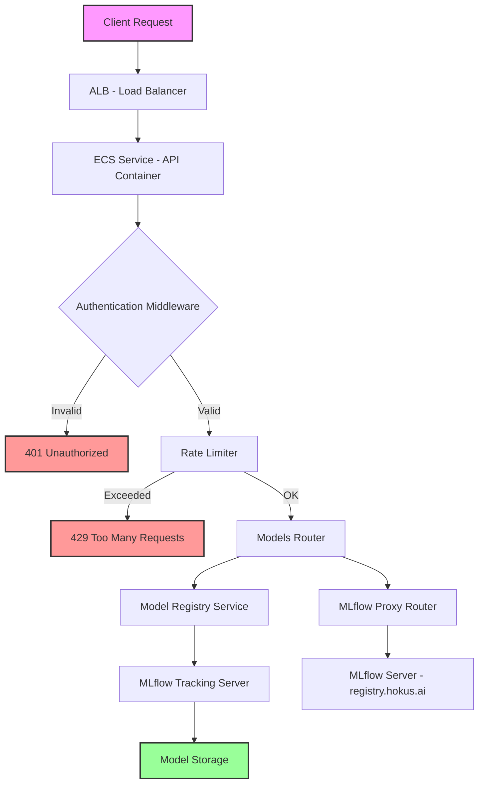

# Model Registration Flow Mapping

## Executive Summary

The Hokusai model registration flow is a comprehensive system that handles model registration, validation, and management through a multi-layered architecture. The flow involves API authentication, request routing through ALB/ECS infrastructure, MLflow proxy integration, and centralized model registry services. This document maps the complete flow from client request to successful model registration.

## High-Level Flow Diagram



## Detailed Step-by-Step Flow

### 1. Client Request Initiation
- **Entry Point**: Client sends POST request to `/models/register`
- **Required Headers**:
  - `Authorization: Bearer <api_key>` or `X-API-Key: <api_key>`
  - `Content-Type: application/json`
- **Request Body**: ModelRegistration object containing:
  - `model_data`: Reference to the model object
  - `model_type`: One of ["lead_scoring", "classification", "regression", "ranking"]
  - `metadata`: Additional model metadata

### 2. Infrastructure Routing (ALB → ECS)
- **ALB Listener Rules**:
  - Main ALB: `/api/*` → API Target Group (Priority: 100)
  - Registry ALB: `registry.hokus.ai` + `/mlflow/*` → MLflow Target Group (Priority: 100)
- **ECS Service**: API container receives request on port 8000

### 3. Authentication Flow
- **Middleware**: `APIKeyAuthMiddleware` (src/middleware/auth.py)
- **Process**:
  1. Extract API key from request headers/query params
  2. Check Redis cache for validation result (5-minute TTL)
  3. If not cached, validate with external auth service:
     ```
     POST {auth_service_url}/api/v1/keys/validate
     Headers: Authorization: Bearer {api_key}
     Body: {"service_id": "ml-platform", "client_ip": "x.x.x.x"}
     ```
  4. Cache successful validation results
  5. Set request state with user context:
     - `request.state.user_id`
     - `request.state.api_key_id`
     - `request.state.service_id`
     - `request.state.scopes`
     - `request.state.rate_limit_per_hour`

### 4. Rate Limiting
- **Primary**: `RateLimitMiddleware` - Global rate limiting
- **Secondary**: `slowapi` Limiter - Route-specific limits
  - `/models/register`: 20 requests/minute
  - `/models/{model_id}/lineage`: 100 requests/minute
  - `/contributors/{address}/impact`: 100 requests/minute

### 5. Request Routing
- **Router**: `models.py` → `register_model()` endpoint
- **Dependencies**: `require_auth` ensures authentication
- **Validation**: Validates model type against allowed types

### 6. Model Registry Service Processing
- **Service**: `HokusaiModelRegistry` (src/services/model_registry.py)
- **Method**: `register_baseline()` for new models
- **Process**:
  1. Validate model object (not None)
  2. Validate model type
  3. Generate model name: `hokusai_{model_type}_baseline`
  4. Start MLflow run
  5. Log parameters:
     - `model_type`
     - `is_baseline`: True
     - `registration_time`: UTC timestamp
     - Additional metadata with `metadata_` prefix
  6. Log model using `mlflow.pyfunc.log_model()`
  7. Register model version with MLflow
  8. Return registration details

### 7. MLflow Integration
- **Tracking URI**: Configured via `MLFLOW_TRACKING_URI` env var
- **Model Storage**: 
  - Artifact path: "model"
  - Registered model name: `hokusai_{model_type}_baseline`
- **Version Management**: Automatic versioning by MLflow

### 8. MLflow Proxy for Direct Access
- **Route**: `/mlflow/*` → MLflow proxy router
- **Proxy Process**:
  1. Convert API paths: `api/2.0/mlflow/` → `ajax-api/2.0/mlflow/`
  2. Forward to `registry.hokus.ai/mlflow`
  3. Add user context headers:
     - `X-Hokusai-User-Id`
     - `X-Hokusai-API-Key-Id`
  4. Remove sensitive headers (Authorization, X-API-Key)
  5. Handle timeouts (30s) and connection errors

### 9. Response Flow
- **Success Response** (201 Created):
  ```json
  {
    "model_id": "hokusai_lead_scoring_baseline/1",
    "model_name": "hokusai_lead_scoring_baseline",
    "version": "1",
    "registration_timestamp": "2024-01-30T12:34:56.789Z"
  }
  ```
- **Error Responses**:
  - 401: Invalid/missing API key
  - 422: Invalid model data or type
  - 429: Rate limit exceeded
  - 500: Internal server error
  - 502: MLflow server connection failed
  - 504: MLflow server timeout

## API Endpoints Documentation

### Model Registration
```http
POST /models/register
Authorization: Bearer {api_key}
Content-Type: application/json

{
  "model_data": {...},
  "model_type": "lead_scoring",
  "metadata": {
    "description": "Baseline lead scoring model",
    "author": "data-science-team"
  }
}
```

### Model Listing
```http
GET /models?name=hokusai_lead_scoring_baseline
Authorization: Bearer {api_key}

Response:
{
  "models": [
    {
      "name": "hokusai_lead_scoring_baseline",
      "version": "1",
      "status": "READY",
      "created_at": 1706620496789,
      "tags": {}
    }
  ]
}
```

### Model Lineage
```http
GET /models/{model_id}/lineage
Authorization: Bearer {api_key}

Response:
{
  "model_id": "hokusai_lead_scoring_baseline",
  "lineage": [...],
  "total_versions": 3,
  "latest_version": "3"
}
```

## Key Data Structures

### ModelRegistration
```python
class ModelRegistration(BaseModel):
    model_data: Dict[str, Any]  # Model object/reference
    model_type: str             # Type of model
    metadata: Dict[str, Any]    # Additional metadata
```

### ModelRegistrationResponse
```python
class ModelRegistrationResponse(BaseModel):
    model_id: str              # Full model ID with version
    model_name: str            # Model name without version
    version: str               # Version number
    registration_timestamp: str # ISO format timestamp
```

### ValidationResult
```python
@dataclass
class ValidationResult:
    is_valid: bool
    user_id: Optional[str]
    key_id: Optional[str]
    service_id: Optional[str]
    scopes: Optional[list[str]]
    rate_limit_per_hour: Optional[int]
    error: Optional[str]
```

## Dependencies and Integration Points

### External Services
1. **Auth Service** (`HOKUSAI_AUTH_SERVICE_URL`):
   - Validates API keys
   - Tracks usage metrics
   - Manages rate limits

2. **MLflow Server** (`registry.hokus.ai/mlflow`):
   - Stores model artifacts
   - Manages model versions
   - Provides model registry UI

3. **Redis Cache**:
   - Caches API key validations (5-minute TTL)
   - Stores rate limit counters

### Internal Components
1. **Model Registry Service**: Core business logic for model management
2. **Performance Tracker**: Tracks model performance metrics
3. **Database Operations**: Stores API key data (if using local auth)

## Error Handling and Edge Cases

### Authentication Failures
- **Missing API Key**: Returns 401 with "API key required"
- **Invalid API Key**: Returns 401 with "Invalid API key"
- **Expired API Key**: Returns 401 with "Invalid or expired API key"
- **IP Restriction**: Returns 401 with "IP address not allowed"

### Model Registration Failures
- **Invalid Model Type**: Returns 422 with specific error
- **MLflow Connection Error**: Returns 502 with connection details
- **MLflow Timeout**: Returns 504 with timeout message
- **Model Storage Error**: Returns 500 with generic error

### Rate Limiting
- **Cache-based**: Uses Redis for distributed rate limiting
- **Fallback**: Allows requests if Redis unavailable
- **Headers**: Returns rate limit info in response headers

## Performance Considerations

### Caching Strategy
- API key validations cached for 5 minutes
- Reduces auth service load
- Redis connection pooling for efficiency

### Timeout Configuration
- Auth service: 5 seconds (configurable)
- MLflow proxy: 30 seconds
- Health checks: 5 seconds

### Async Processing
- Usage logging done asynchronously
- Non-blocking for main request flow
- Fire-and-forget pattern for metrics

## Security Measures

### API Key Security
- Keys hashed with bcrypt before storage
- Never logged or exposed in responses
- Stripped from MLflow proxy requests

### Request Validation
- Ethereum address format validation
- Model type whitelist enforcement
- Input sanitization for metadata

### Audit Trail
- All MLflow access logged with user context
- Usage metrics sent to auth service
- Request/response timing tracked

## Potential Issues and Improvements

### Current Limitations
1. **Single MLflow Instance**: No failover for MLflow server
2. **Cache Dependency**: Redis required for optimal performance
3. **Synchronous Registration**: No background processing for large models

### Recommended Improvements
1. **MLflow HA**: Implement MLflow server clustering
2. **Queue-based Registration**: Use message queue for async processing
3. **Model Validation**: Add model quality checks before registration
4. **Versioning Strategy**: Implement semantic versioning for models
5. **Backup Strategy**: Regular MLflow artifact backups

### Monitoring Recommendations
1. Track registration success/failure rates
2. Monitor MLflow server response times
3. Alert on auth service failures
4. Track cache hit rates for optimization